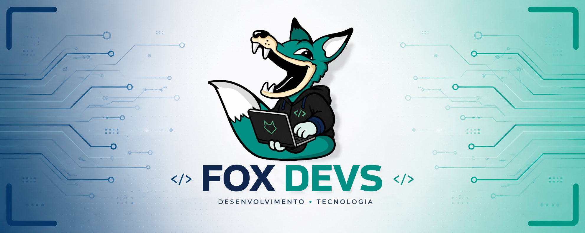

  Grupo formado por alunos do 2º ano de Informática para Internet para portifólio de matérias desenvolvidas durante aula  

  

  

  

  

  

  

  
  &nbsp;&nbsp;

  
  &nbsp;&nbsp;

  
  &nbsp;&nbsp;

  
  &nbsp;&nbsp;

  
  

 

  

